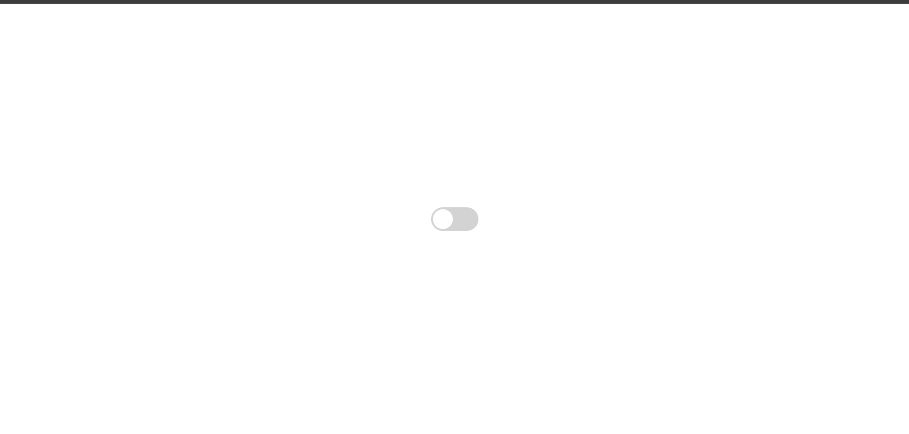

# 🌗 DarkLight Toggle

DarkLight Toggle is a simple and elegant feature that allows users to seamlessly switch between **dark mode** and **light mode** in a web interface. It enhances accessibility, reduces eye strain, and improves overall user experience with modern UI practices.
---

## 🚀 Profile 
<a href="https://www.linkedin.com/in/dharmendraverma95/" target="_blank">🧑‍💻 LinkedIn Profile </a> | <a href="https://www.behance.net/dhirukumar" target="_blank">🧑‍💻 Behance Profile </a>

---

## 🔧 Features

- 🌞 Toggle between Light and Dark themes
- 💡 Responsive and accessible UI design
- ⚙️ Built with HTML, CSS, and JavaScript
- 🌐 Supports system preference detection (`prefers-color-scheme`)
- 🔄 Smooth transition animations

---

## 🛠️ Technologies Used

- HTML5
- CSS3 (with CSS Variables)
- Vanilla JavaScript

---

## 📂 Project Structure
DarkLight-Toggle/
├── index.html
├── style.css
├── main.js
├── README.md
└── IMG

📌 Use Cases
- Portfolio websites
- Blogs and documentation sites
- Web apps with a UI customization feature

- - 
👉 Desktop Design 

👉 Desktop Design 
